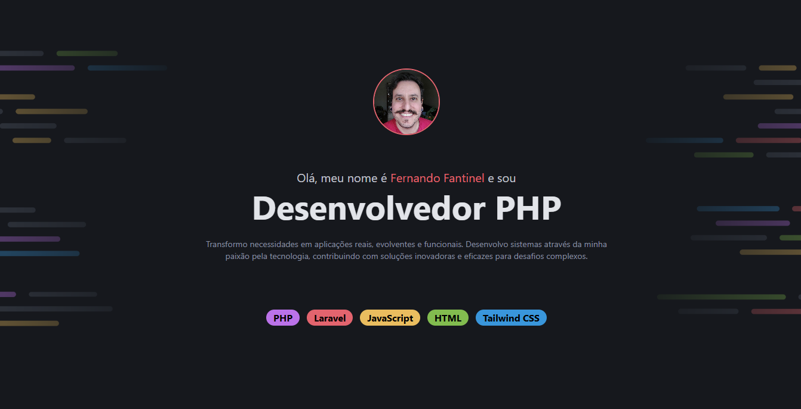

<h1 align="center">Portfólio</h1>

  <a href="#-tecnologias">Tecnologias</a>&nbsp;&nbsp;&nbsp;|&nbsp;&nbsp;&nbsp;
  <a href="#-projeto">Projeto</a>&nbsp;&nbsp;&nbsp;|&nbsp;&nbsp;&nbsp;
  <a href="#-licença">Licença</a>

  

 

  

## 🚀 Tecnologias

Esse projeto foi desenvolvido com as seguintes ferramentas:

- HTML
- Tailwind CSS
- JavaScript
- Git e GitHub

## 💻 Projeto

Site pessoal para exibir os projetos realizados até o momento.

- [Acesse o projeto](https://portfolio.fantinel.dev.br)

## 📝 Licença

Esse projeto está sob a licença MIT.